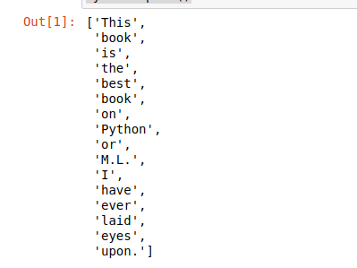
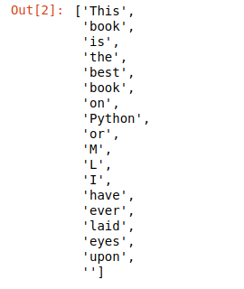
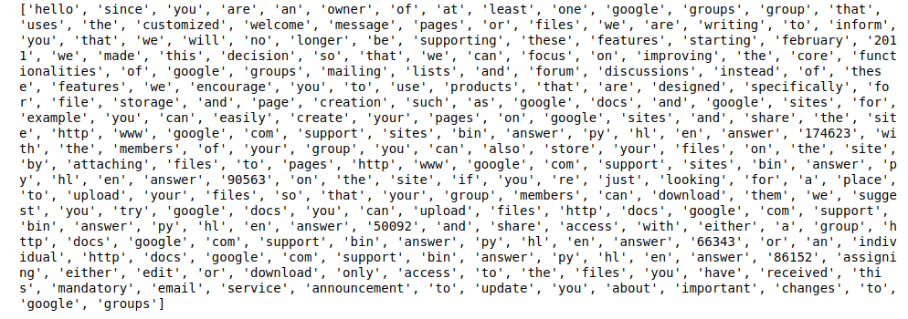
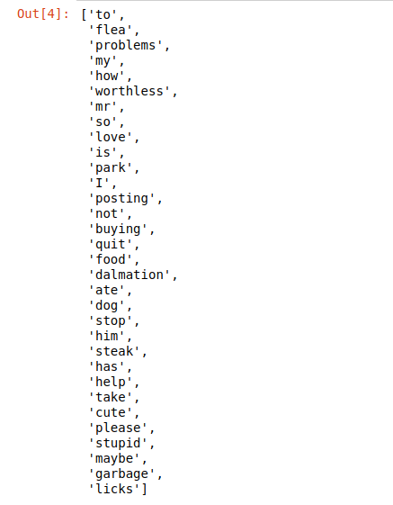
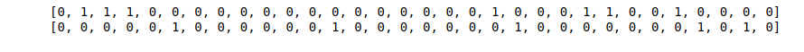
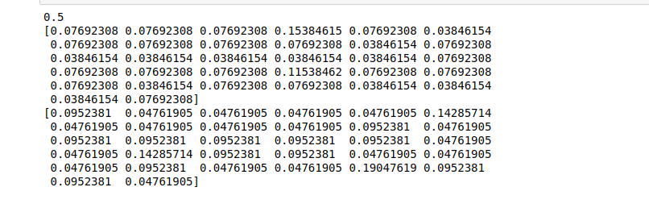
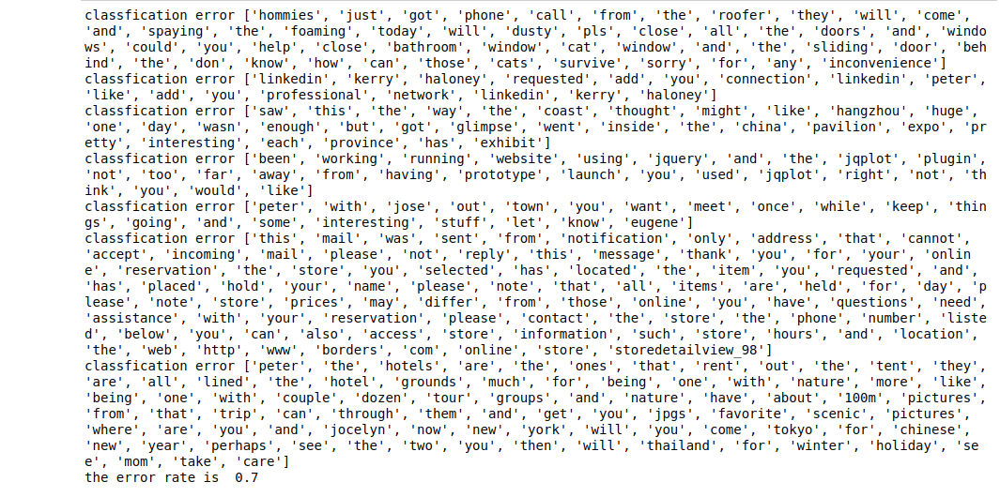

# Lab6 Navies Bayes应用实践

## 学生信息

* 学院：数据科学与计算机学院
* 专业：软件工程
* 学号：18308008
* 姓名：车春江

## 实验目的

利用 Python 实现 Naïve Bayes 分类器。文档切分成词,通过集合元素的唯一性生成词汇列表(不包括重复词汇),进而构建词向量(词集向量或词袋向量),从词向量计算概率,然后构建分类器对邮件文档分类,以检测垃圾邮件

## 实验环境

* Python 3.7.6
* Anaconda 4.8.3
* Jupyter notebook 6.0.3

## 实验步骤

### 准备数据

#### 切分文本成词

```
# 利用string.split()方法切分文本字符串
mySent = "This book is the best book on Python or M.L. I have ever laid eyes upon."
mySent.split()
```

```
# 利用正则表达式切分,其中的分隔符是除单词、数字外的任意字符串
import re
regEx = re.compile('\\W+')
listOfTokens = regEx.split(mySent)
listOfTokens
```

```
# 列表推导式的应用
emailText = open('email/ham/6.txt', encoding=
 'ISO-8859-1').read()
listOfTokens = regEx.split(emailText)
listOfTokens=[tok.lower() for tok in listOfTokens if len(tok) > 0]
print(listOfTokens)
```

#### 生成词汇表

```
# 函数 loadDataSet()生成实验样本集
# 函数 createVocabList()建立词汇表
import bayes
listOPost, listClasses = bayes.loadDataSet()
myVocabList = bayes.createVocabList(listOPost)
myVocabList
```

#### 生成词向量

```
# 调用 setOfWords2Vec()函数生成词集向量
# 构建 listOPost 列表 0 位置对应的词集向量
setOfWords2Vec0 = bayes.setOfWords2Vec(myVocabList, listOPost[0])
print(setOfWords2Vec0)
# 构建 listOPost 列表 3 位置对应的词集向量
setOfWords2Vec3 = bayes.setOfWords2Vec(myVocabList, listOPost[3])
print(setOfWords2Vec3)
```

### 训练模型

```
# 测试 train()函数,返回两个概率向量和一个概率值
# for 循环使用词向量充填 trainMat 列表
trainMat = []
for postinDoc in listOPost:
    trainMat.append(bayes.bagOfWords2Vec (myVocabList, postinDoc))
p0V, p1V, pAb = bayes.train(trainMat, listClasses)
print(pAb)
print(p0V)
print(p1V)
```

### 测试模型

```
# spamTest()函数完成测试
bayes.spamTest()
```

## 实验结果与分析

### 准备数据

#### 切分文本成词

利用string.split()方法切分文本字符串



利用正则表达式切分,其中的分隔符是除单词、数字外的任意字符串



列表推导式的应用



#### 生成词汇表



#### 生成词向量



### 训练模型



### 测试模型



#### 

## 操作习题

### 分别计算示例1中不换门得宝和换门得宝的概率

换门得宝的概率是$\frac{2}{3}$，不换门得宝的概率是$\frac{1}{3}$

### 实现、验证极大似然估计示例

```
# 实现极大似然估计
import numpy as np
from scipy.stats import norm
import matplotlib.pyplot as plt

μ = 30  # 数学期望
σ = 2  # 方差
x = μ + σ * np.random.randn(10000)  # 正态分布
plt.hist(x, bins=100)  # 直方图显示
plt.show()
print(norm.fit(x))  # 返回极大似然估计，估计出参数约为30和2
```

### 利用 sklearn 中 BernoulliNB 分类该邮件数据集

```
from sklearn.naive_bayes import BernoulliNB
import numpy as np
from bayes import textParse
from bayes import createVocabList
from bayes import bagOfWords2Vec

def myskBernoulliNB():
    fullTest = [];docList = [];classList= []
    # it only 25 doc in every class
    for i in range(1,26): 
        wordList = textParse(open('email/spam/%d.txt' % i,encoding="ISO-8859-1").read())
        docList.append(wordList)
        fullTest.extend(wordList)
        classList.append(1)
        wordList = textParse(open('email/ham/%d.txt' % i,encoding="ISO-8859-1").read())
        docList.append(wordList)
        fullTest.extend(wordList)
        classList.append(0)
    # create vocabulary
    vocabList = createVocabList(docList)   
    trainSet = list(range(50));testSet=[]
    # choose 10 sample to test ,it index of trainMat
    for i in range(10):
        randIndex = int(np.random.uniform(0,len(trainSet)))#num in 0-49
        testSet.append(trainSet[randIndex])
        del(trainSet[randIndex])
    trainMat = []; trainClass = []
    for docIndex in trainSet:
        trainMat.append(bagOfWords2Vec(vocabList,docList[docIndex]))
        trainClass.append(classList[docIndex])
    clf=BernoulliNB()
    #print(type(np.array(trainMat)))
    clf.fit(np.array(trainMat),np.array(trainClass))    
    errCount = 0
    for docIndex in testSet:
        wordVec=bagOfWords2Vec(vocabList,docList[docIndex])
        #print(wordVec)
        if clf.predict(np.array([wordVec])) != classList[docIndex]:
            errCount += 1
            print (("classfication error"), docList[docIndex])

    print (("the error rate is ") , float(errCount)/len(testSet))
    return float(errCount)/len(testSet)

ave=0
for i in range(10):
    ave=ave+myskBernoulliNB()
print('average error rate:',ave/10)
```

### 将词集向量用 TF-IDF 词向量替代,测试分析结果

```
from sklearn.naive_bayes import BernoulliNB
from sklearn.feature_extraction.text import TfidfTransformer  
from sklearn.feature_extraction.text import CountVectorizer
import numpy as np
import scipy
def myskBernoulliNB2():
    fullTest = [];docList = [];classList= []
    # it only 25 doc in every class
    for i in range(1,26): 
        wordList = open('email/spam/%d.txt' % i,encoding="ISO-8859-1").read()
        docList.append(wordList)
        fullTest.extend(wordList)
        classList.append(1)
        wordList = open('email/ham/%d.txt' % i,encoding="ISO-8859-1").read()
        docList.append(wordList)
        fullTest.extend(wordList)
        classList.append(0)
    # create vocabulary
    vocabList = createVocabList(docList)   
    trainSet = list(range(50));testSet=[]
    # choose 10 sample to test ,it index of trainMat
    for i in range(10):
        randIndex = int(np.random.uniform(0,len(trainSet)))#num in 0-49
        testSet.append(trainSet[randIndex])
        del(trainSet[randIndex])
    transformer = TfidfTransformer()
    vectorizer = CountVectorizer()
    #print(transformer)
    #print(docList)
    tfidf = transformer.fit_transform(vectorizer.fit_transform(docList)).A
    #print(type(tfidf.A))
    #print(tfidf.A)
    trainmail=[tfidf[i] for i in trainSet]
    trainClass=[classList[i] for i in trainSet]
    testmail=[tfidf[i] for i in testSet]
    testClass=[classList[i] for i in testSet]
    #print(np.array(trainmail[1]))
    #print(trainmail)
    #trainMat.voc=vectorizer.vocabulary_
    #print(trainMat)
    clf=BernoulliNB()
    #print(type(np.array(trainMat)))
    #print(type(tfidf))
    #print(trainmail)
    clf.fit(scipy.mat(trainmail),trainClass)    
    print(clf.score(scipy.mat(testmail),testClass))

myskBernoulliNB2()
```

### 选择适合的模型对购买计算机示例数据集建模

```
from sklearn.naive_bayes import MultinomialNB
data81=["youth high no fair no",
"youth high no excellent no",
"middle_aged high no fair yes",
"senior medium no fair yes",
"senior low yes fair yes",
"senior low yes excellent no",
"middle_aged low yes excellent yes",
"youth medium no fair no",
"youth low yes fair yes",
"senior medium yes fair yes",
"youth medium yes excellent yes",
"middle_aged medium no excellent yes",
"middle_aged high yes fair yes",
"senior medium no excellent no",
]
n=len(data81)
mat81=[]
cls81=[]
for i in range(n):
    spl=data81[i].split()
    tmp=[spl[j] for j in range(4)]
    mat81.append(tmp)
    if (spl[4]=='yes'):
        cls81.append(1)
    else:
        cls81.append(0)
for j in range(4):
    dict={}
    cnt=0
    for i in range(n):
        if not (mat81[i][j] in dict):
            dict[mat81[i][j]]=cnt
            cnt+=1
    for i in range(n):
        mat81[i][j]=dict[mat81[i][j]]
print(mat81)
print(cls81)
#mat81=[[1,1],[0,1]]
#cls81=[0,1]
clf=MultinomialNB()
clf.fit(np.array(mat81),np.array(cls81)) 
err=0
tot=0
for i in range(n):
    tot+=1
    if clf.predict(np.array([mat81[i]]))!=cls81[i]:
        err+=1
print('error rate:',err/tot)
```

## 实验总结

* 朴素贝叶斯分类器可能分类效果会比KNN算法差，但是其时间复杂度比KNN要低。KNN算法单次预测时间复杂度高达O(nmk)或者O(nmlogk)(需要数据结构维护最近的k个样本),n为样本集样本的数目，m为数据的维数。而贝叶斯分类器的样本训练时间为O(nm)，单次预测时间复杂度仅为O(m)，时间复杂度较低，测试集大时，贝叶斯分类器明显快于KNN算法。这样在实际应用时可以将两种算法结合起来，在贝叶斯分类器分到一个类别概率明显高于其他类别时，预测成功概率较大，可以直接运用这个结果。而当贝叶斯分类器无法得到一个概率特别大的可能类别时，再用KNN算法辅助判断预测出最合适的类别
* 离散型特征数据一般可以直接用频率估计概率，计算出每个特征对应每个分类的概率，或者用离散型均匀分布、二项分布、多项分布、几何分布、负二项分布、泊松分布等离散型随机变量来拟合估计概率。而连续性特征数据可以先求出数据集的统计值，然后用连续型均匀分布、指数分布、正态分布、伽马分布、贝塔分布、t分布、F分布来作为估计概率的概率密度函数
* 实现贝叶斯分类器时，分母P(X)可以不用在计算式中处理。因为每个类别计算的概率都有一个/P(X)的公共部分。每一类的相对概率大小不会因为同除P(X)发生改变，所以不同除P(X)依然可以找出最优的分类。而同除P(X)不仅是无用的操作，而且还会引入精度误差